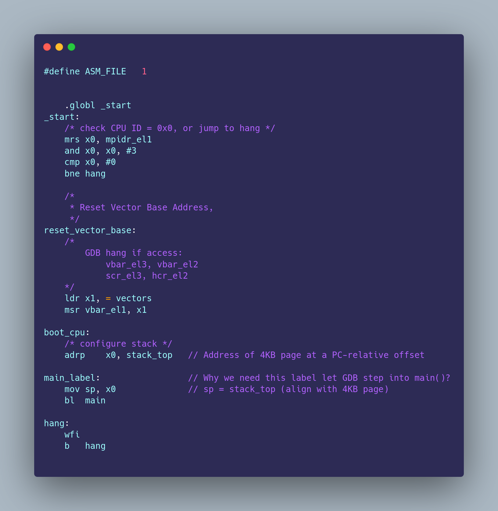
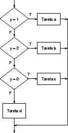
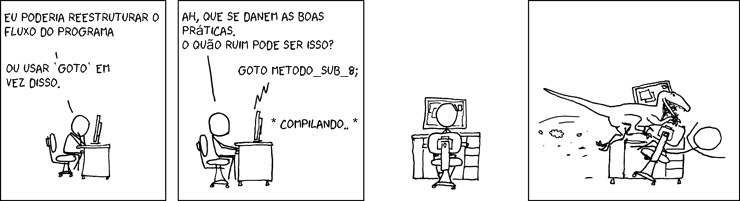
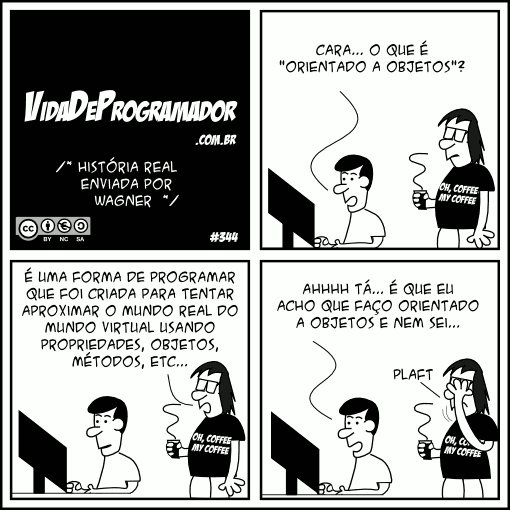

# Paradigmas de Programação
Um paradigma de programação pode ser entendido como o modo que um problema é resolvido, ao considerar linguagens de programação como ferramentas temos os paradigmas de programação diretamente ligados a _como_ usar a ferramenta, _onde_, e em _qual_ problema devemos usar tal ferramenta para uma solução prática e eficiente. Embora em tese podemos fazer o mesmo sistema com uma linguagem estruturada, imperativa e orientada aa objetos devemos  pensar em como cada abordagem, com suas vantagens e desvantagens é adequada a construção do sistema.

## Exemplos
Abaixo segue os principais paradigmas de programação e algumas linguagens que os implementam, deixando claro que muitas linguagens de programação permitem o uso de mais de um paradigma. 
| Paradigma | Linguagens de Programação |
| ------ | ------ |
| Imperativo | Assembly, Basic, Fortran 
| Estruturado| Ada, C |
| Orientado à Objetos | C++, Dart, Java |
| Funcional | Haskell, Scala
| Declarativo | HTML, XAML, SQL
| Lógico | Prolog

## Imperativo
 Neste paradigma é preciso que o programador descreva todo o passo a passo do que o programa deve executar, sua característica marcante é o uso do goto, que permite o salto incondicional para um trecho de código. Um exemplo de linguagem declarativa é o Assembly, tanto para x86 quanto para ARM e demais arquiteturas. Embora temido por muitos programadores de linguagens de alto nível o assembly tem seu uso em sistemas que praticamente não exigem manutenção e são próximos ao aço. Podemos citar o uso em sistemas embarcados sem sistema operacional e funções realizadas pela BIOS. A imagem abaixo é um exemplo de configuração de boot para um processador ARM v8 para mais o repositório original encontra-se [aqui](https://github.com/cirosantilli/armv8-bare-metal/).
 


## Estruturado
Diferente do Imperativo o paradigma estruturado, separa o programa em blocos. O uso de estruturas de seleção e laços permite código mais legível, mais fácil de ser depurado e mantido. As estruturas que permitem a divisão em blocos são de três tipos: Sequenciais, Condicionais e de Repetição.
- Sequencial: Alinhamos as intruções para seguirem uma ordem sequencial.
- Condição: As ações podem ter seu caminho desviado a depender se uma condiçãoo é ou não atendida.
- Repetição: O mesmo bloco de código pode executar até que uma condição seja atendida.



Uma boa prática é reduzir o máximo o uso do GOTO, embora seja útil em alguns casos, em programas maiores  pode resultar em um código com baixa legibilidade e dificultar o reuso de software.



Um exemplo de software muito interessante é o [sqlite](https://www.sqlite.org/index.html), escrito em C, consiste em uma bilbioteca que permite o uso de operações de banco de dados relacionais, porém sem exigir o uso de um servidor, com isso é obtido um ganho de performance altíssimo e simplicidade na hora de configurar o banco para uso.

## Orientado a Objetos
Com o intuito de aproximar as abstrações do código com a vida real, a orientação a objeto surge como uma forma de representar objetos (praticamente qualquer coisa que exista) e suas propriedades. Um exemplo famoso é pensar em um *Cachorro*, ele tem propriedades, cor, tipo de pelagem, altura, peso. Também possuí suas ações únicas: Latir, Rolar, Fingir de Morto. Por meio de seus atributos e metódos podemos representar um cachorro do mundo real. Suponha que nosso *Cachorro* passa a ser algo mais específico e menos genérico, agora temos em mãos um shih tzu chamado Carlos. 


No *Cachorro* definido anteriormente não temos como guardar a informação que nosso Carlos é um shih tzu, embora isso possa ser resolvido adicionando a propriedade nome e raça, por exemplo, vamos imaginar que não é o caso de fazermos isso e que precisamos lidar com este problema de outra forma. O que fazer? Temos informações boas no nosso *Cachorro* e seria interessante fazer uso do reuso (risos), com a Orientação a Objetos é possível trabalhar com uma classe *ShihtZu* que herda as propriedades do nosso *Cachorro*.

Embora o exemplo supracitado do nosso *Cachorro* abstrado possa parecer extremamente sujo pelo fato de poder ser facilmente resolvido, a ideia principal é explorar que a OO (Orientação a Objetos) permite  facilidade na hora de aproveitar um código, com a modularização e criação de componentes podemos criar softwares gigantescos com várias pessoas cuidando de partes específicas sem pensar no programa como um só.



Uma empresa interessante com projetos que usam e abusam do reuso de código é a [JetBrains](https://www.jetbrains.com/pt-br/). Com produtos focados para os desenvolvedores, sendo seu foco a produção de IDE para uma vasta gama de linguagens de programação, vemos em suas IDEs vários pontos em comum com a mudança a depender da especificidade do projeto. PyCharm que é focado no Python tem características únicas para desenvolvedores python, assim como Goland para programadores do Go, é necessário fazer todo o código do zero? obviamente não, e a OO surgiu exatamente com isso em mente. 


## Declarativo
Na programação declarativa o foco é sobre o conteúdo e não em _como_ ele é representado. Grandes exemplos do paradigma declarativo são linguagens de marcação e o SQL. Abaixo seguem exemplos de uma busca SQL e uma página HTML simples.

 ``SELECT * FROM user WHERE idade > 17 ``
```html
 <!DOCTYPE html>	
<html>	
    <head>	
        <title>Atividade da semana 2</title>	
    </head>	
<body>	
    <h1>Programação funcional é 10</h1>	
    <p>Nada além disso precisa ser dito/p>	
    </body>	
</html>
```


No SQL selecionamos todos os usuários com 18 anos ou mais, note que não é necessário saber como a lógica da busca é implementada, como ocorrerá o processo, somente no que de fato declaramos e obteremos como retorno. De forma similar na nossa página HTML em nenhum momento pensamos no *como*, escrevemos o que deve ser tratado e passamos o tratamento para um terceiro, no HTML o Browser e no SQL o Sistema Gerenciador de Banco de Dados em questão (MySQL, MariaDB, etc.).


## Lógico
Já o Paradigma Lógico é baseado em **fatos** e **regras de inferência**, com seu principal representante a linguagem Prolog. Usado en projetos de inteligência artificial, uma  vantagem é que a facilidade de provar que o problema está correto porém para cálculos matemáticos tende a ser mais lento.

## Funcional
